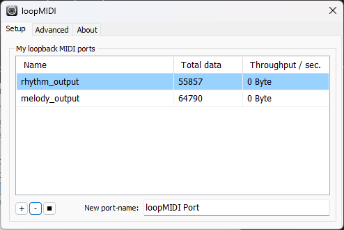
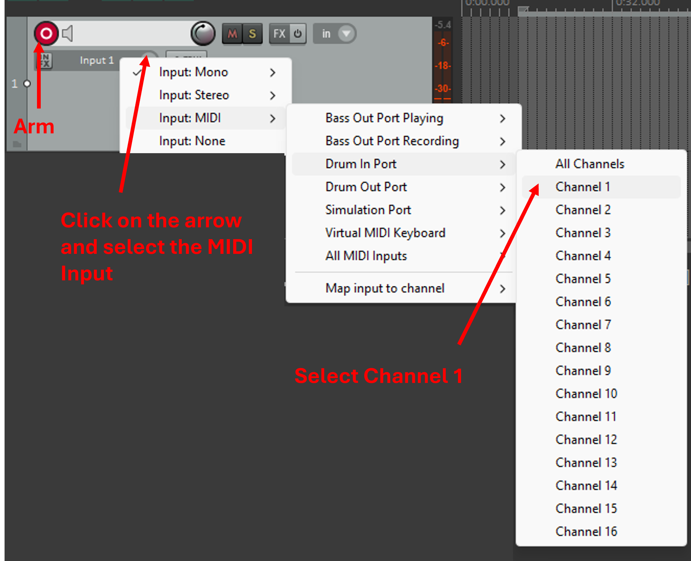

# AI-Affective Music Improviser
**AI-Affective Music Improviser** is a deep neural network-based system that establishes a direct connection with the minds of musichans to create music in real-time. 

## Description
The Imporviser acquires data from both the musician's instrument and a BCI device. 
The instrument sound must be in **MIDI** format while the BCI measures the **EEG** signal coming from the user.
Data are processed in parallel, in real-time and fed into the generative model that produce the affective music.
You can choose among two different architectures: [TCN](generative_model/architectures/tcn.py) and [Transformer](generative_model/architectures/musicTransformer.py).
Depending on the application, the AI-Affective Music Improviser can compose an accompaniament melody with chords or play a drum pattern following the rithm of the input instrument.
In both cases, the output of the network is leaded by the musichan's emotive state which is classified as "relaxed" or "excited".

## Table of Contents
- [Getting Started](#getting-started)
  - [Prerequisites](#prerequisites)
  - [Installation](#installation)
  <!-- - [Issues](#issues) -->
- [Usage](#usage)
  - [Gui](#gui)

## Getting Started
The following lines describe how to setup the environment to play the Improviser in local.

### Prerequisites

* [loopMIDI](https://www.tobias-erichsen.de/software/loopmidi.html)
* [Reaper](https://www.reaper.fm/download.php)
* [Python 3.x](https://www.python.org/downloads/)
* [Processing](https://processing.org/download)

### Installation

1. Clone the repository
```bash
git clone https://github.com/marc0bortolotti/Affective-AI-Music-Improviser.git
cd Affective-AI-Music-Improviser
```

2. Create a virtual environment
```bash
# Using venv
python3 -m venv venv
# Activate the virtual environment
source venv/bin/activate   # On Linux/Mac
venv\Scripts\activate      # On Windows
```

3. Install the required packages
```bash
pip install -r requirements.txt
```

4. Open loopMIDI and create Virtual MIDI Ports by entering the name and clicking on **+**.

<!--  -->

At this step, you should create 2 virtual ports for: 
- **PORT_1**: OUTPUT port for playing the melody on Reaper
- **PORT_2**: OUTPUT port for playing the rhythm on Reaper

5. Open Reaper and ensures that those ports are active (Options->Preferences->Audio->MIDI Inputs). 
6. Create 2 new tracks (Track->Insert New Track) and arm them. Set  **PORT_1** and **PORT_2** respectively as INPUT sources.
<!--  -->


## Usage
Run the following command to play the AI-Affective Music Improviser, 
```bash
python main.py
```
The command will open a window in which you have to select the corresponding MIDI ports and the EEG device.
**NOTE:** If you want to run a simulated MIDI instruments, select "Simulate Instrument" as INPUT port.

### GUI
If you want to see the internal state of the Improviser, you can run this [Processing sketch](gui/Processing/main.pde). 
The state is represented through a bouncing emoticon that indicates the level of satisfation of the Improviser.


